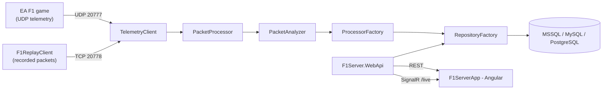

# Architecture

This document describes how F1-Telemetry is put together and, where the reasoning
is recoverable from the code, comments or existing docs, *why* it looks the way it
does. It complements [`README.md`](../README.md) (setup and configuration),
[`CONTRIBUTING.md`](CONTRIBUTING.md) (workflow), [`UNIT_TESTS.md`](UNIT_TESTS.md)
(test conventions) and [`dependency-decisions.md`](dependency-decisions.md) (NuGet
package choices) rather than repeating them.

Where a design decision is not explained anywhere in the repository, this document
says so explicitly instead of inventing a rationale. A few such gaps are listed in
[Undocumented decisions](#undocumented-decisions) at the end.

---

## High-level shape



Two runtime processes ship as two Docker images (see [Deployment](#deployment)):
the .NET service (UDP listener, packet processing, REST API, SignalR hub) and the
Angular web app (served as static files by nginx).

The solution file is `.slnx` rather than the legacy `.sln` format — this is simply
the current Visual Studio standard for solution files, not a migration artifact or
tooling workaround.

---

## Packet ingestion & processing pipeline

1. **`TelemetryClient`** (`F1Server.Service`) opens a `UdpClient` on the telemetry
   port (`20777` by default) and a `TcpListener` on the replay port (telemetry port
   + 1, `20778` by default) and receives asynchronously.
2. Every received packet goes to **`PacketProcessor.ProcessPacket`**
   (`F1Server.Service/Runtime/PacketProcessor.cs`), which tracks session and game
   version changes and hands the raw bytes to `PacketAnalyzer.GetPacketData`.
3. **`PacketAnalyzer`** (`F1Server.Core/PacketAnalyzer.cs`) dispatches on
   `PacketHeader.PacketType` to one reusable `PacketToXBase`-derived transformer per
   packet kind (e.g. `PacketToSessionData`). The class doc explains why exactly one
   instance is kept per packet type rather than created per call: the transformers
   are stateful, so "every concurrent processing path needs its own instance" — in
   practice this means a `PacketAnalyzer` is not meant to be shared across
   concurrently-processed sessions.
4. Inside each transformer, a **second dispatch happens by game version**. For
   example `PacketToSessionData.ExtractSessionDataPacket` switches on
   `GameVersion` from 2019 through 2026 and calls a separate `GetSessionData20XX`
   method per year, each reading a different expected payload size
   (`ConstData.F12019SessionSize` … `F12026SessionSize`). The same pattern repeats
   for every packet type. This is the concrete reason the codebase (and
   `F1Server.Tests`, with one folder per game year) is organized per game version:
   **EA changes the binary packet layout with most yearly game releases**, so a
   single generic parser cannot cover all supported games. Adding support for a new
   game year means adding a new per-year extraction path, not modifying the
   existing ones — this is why the packet tests are split the same way (see
   [`UNIT_TESTS.md`](UNIT_TESTS.md)).
5. The resulting typed object goes back through `PacketProcessor`, which asks
   **`ProcessorFactory.GetProcessor`** (`F1Server.Service/Processors/ProcessorFactory.cs`)
   for a `BaseProcessor` keyed by `PacketTypes` (Session, Participants, LapData,
   SessionHistory, CarStatus, CarTelemetry, FinalClassification, TimeTrial,
   LapPositions). Processors are cached **per session** and the cache is cleared
   whenever the session changes, because processor instances hold header
   information for the session they were created for and must not leak state
   across sessions.
6. The processor persists the object through **`RepositoryFactory`** (see below).

## Game version specifications

- Every supported game year has a corresponding specification document under
  `docs/` — e.g. `docs/F1 2025 Telemetry.md` for the 2025 game — converted from
  EA's official UDP telemetry release for that year (the original PDF/DOCX/TXT is
  kept alongside it under [`docs/original-specs/`](original-specs)). These
  documents are the authoritative source for packet layouts, field types, and
  appendix reference data (driver, team, track, nationality IDs) for that year,
  and are what the per-year extraction paths described above (point 4) are
  implemented against.
- **A new game version must not be implemented before its specification document
  exists under `docs/`.** Adding support for a new EA release means: obtain and
  add the official specification (`F1 20XX Telemetry.md`, plus the original
  PDF/DOCX/TXT under `docs/original-specs/`) first, then implement the per-year
  extraction paths, entities, migrations, and tests against it — never the other
  way around. This keeps every packet-layout change traceable to a written,
  checked-in source instead of being reverse-engineered from captured packets or
  guesswork.
- Implementation plans for a new game version (see e.g.
  [`docs/concepts/integrate_f1_2026.md`](concepts/integrate_f1_2026.md)) should
  reference specific sections of that year's specification document for every
  field-level or size change they describe.

## Data access

- **`RepositoryFactory`** (`F1Server.Db/Entity/RepositoryFactory.cs`) wraps a
  pooled `PooledDbContextFactory<F1ServerDbContext>` and hands out repository
  instances through compiled constructor delegates cached per type, avoiding
  reflection on every call. The standard usage pattern everywhere in the codebase
  is:

  ```csharp
  using (var dbFactory = RepositoryFactory.CreateInstance())
  {
      var sessionRepository = dbFactory.GetRepository<SessionRepository>();
  }
  ```

- **`RepositoryBase<TQueryable, TEntity>`** exposes `GetQuery()` returning
  `AsNoTracking()` queries, plus a shared `LastError` property. `LastError` exists
  specifically to let a caller distinguish "the repository caught an exception"
  from "the query legitimately found nothing" — both would otherwise look like a
  `null`/empty result to the caller.
- **Provider selection is runtime configuration, not a build-time choice.**
  `F1ServerDbContext.DetectServerType()` reads `F1SERVER_DATABASE_TYPE`
  (`1` = MariaDB/MySQL, `2` = MSSQL, `3` = PostgreSQL, `99` = EF Core in-memory,
  used only by `F1Server.Tests`; unset defaults to `1`/MariaDB). One Docker image
  therefore serves all three supported databases — the provider is picked by an
  environment variable, not by shipping separate images per database.
- **Migrations are split into three projects** (`F1Server.Db.MsSqlMigrations`,
  `F1Server.Db.MySqlMigrations`, `F1Server.Db.PostgreSqlMigrations`) instead of
  one. The repository does not state the reason explicitly, but it follows
  directly from how EF Core migrations work: each provider needs its own model
  snapshot and its own migration history, since column types, precision and
  provider-specific SQL differ per engine. A single shared migration history
  cannot target three different SQL dialects, so the split is a consequence of
  supporting three databases from one codebase rather than an arbitrary
  organizational choice. Because of this, schema changes must be applied to all
  three provider projects to keep them in sync (see the migration workflow in
  [`CLAUDE.md`](../CLAUDE.md)).

## Web API & real-time updates

- **`WebHosting.cs`** (`F1Server.WebApi`) is the composition root: it registers
  the business services (`ChampionshipService`, `CarTelemetryService`, etc.) so
  that "the controllers stay limited to the transport concerns", wires up
  Swagger, `HybridCache` (5-minute default expiration), a permissive CORS
  policy, static file serving for the Angular build, and maps the SignalR hub.
- **Why `HybridCache` instead of plain `IMemoryCache`:** `HybridCache` combines
  a local in-process L1 cache with an optional distributed L2 cache behind the
  same API. Only the L1 layer is used today, but the choice was made
  deliberately so that a distributed cache (e.g. Redis) could be added later —
  for example to share cache state across multiple service instances — without
  changing any of the caching call sites throughout the code.
- **Controllers stay thin** by design: business logic lives in services/processors,
  controllers only translate HTTP requests into service calls.
- **`LiveSessionHub`** (`/live`) is an empty `Hub` — it has no server-invokable
  methods. Broadcasting is driven from the outside: `LiveSessionController`
  polls the current live-session state with `TimerManager` and, only when that
  state actually changed (diffing the last known `IsLiveSession`/session id),
  pushes `"IsLiveSession"` / `"LiveSessionDataUpdated"` events to every connected
  client via `IHubContext<LiveSessionHub>.Clients.All.SendAsync`. The hub is a
  broadcast channel, not an RPC endpoint.
- **No authentication or authorization is implemented.** Every controller action
  and the `/live` hub are anonymously reachable; this is a documented, deliberate
  fact (see [`CLAUDE.md`](../CLAUDE.md)), not an oversight to silently work
  around. Do not describe cookie- or OAuth-based authentication as configured —
  it isn't. Because of this, mutating endpoints must use the matching HTTP verb
  (`POST`/`PUT`/`DELETE`, never `GET`) so state-changing calls cannot be triggered
  by a plain link, an `` tag, or another cross-site request — that verb
  discipline is the actual safety net in the absence of auth.
- **Why there is no auth layer at all:** F1-Telemetry is built for private,
  local-network use — a single user or a small group on a trusted LAN running
  their own instance, not a multi-tenant service exposed to the internet. Given
  that scope, adding a login/authorization layer was deliberately left out
  rather than deferred as unfinished work. A direct consequence is that
  mutating actions such as creating championships or deleting sessions are
  reachable by anyone who can reach the API, with no further access control —
  this is accepted as fine for the intended deployment (a private network),
  not a gap to close. Treat any future request to add auth as a scope change
  that needs an explicit decision, not a bug fix.

## Observability

- **`F1Server.Observability`** builds three independent OpenTelemetry pipelines —
  tracing, metrics and logging — each configured separately in
  `ObservabilityConfiguration`.
- Activation is **conditional and per-signal**: startup only attempts to
  configure observability when `F1SERVER_OTLP_TARGET` parses to a known numeric
  value *and* at least one of `F1SERVER_OTLP_TRACES_URL` /
  `F1SERVER_OTLP_METRICS_URL` / `F1SERVER_OTLP_LOGGING_URL` (or the legacy
  `F1SERVER_OTLP_URL` fallback for traces) is set. Each signal is then enabled
  independently based on whether its own endpoint variable is present. When
  nothing is configured, startup logs that observability is unavailable and the
  service keeps running normally. In other words, the application does not
  require an OpenTelemetry collector to function — observability is opt-in
  infrastructure layered on top of a service that works without it, which
  matters for anyone running the Docker image standalone without the rest of an
  observability stack.
- All exporters use OTLP/**gRPC**, so configured endpoints must point at a
  gRPC-capable collector (typically port `4317`).

## Desktop tools and F1Server.Shared

- **`F1Server.Shared`** is referenced only by `F1ReplayClient` and
  `F1SessionFolderRename` (and by `F1Server.Tests`, to test that shared code) —
  never by the server projects (`F1Server`, `F1Server.Service`,
  `F1Server.WebApi`, …). It holds session-file detection and filesystem helpers
  that are only relevant to local desktop tooling working with recorded packet
  captures on disk; the live UDP/DB pipeline has no use for them, which is why
  the boundary is kept strict rather than folding this into a shared core
  library.
- **`F1ReplayClient`** (WPF) replays previously recorded packet files to the
  service's TCP replay port, so a session can be re-processed without a live
  game running.
- **`F1PacketTester`** (console) reads recorded packet files from disk and runs
  them through packet analysis for format verification/debugging outside the
  live pipeline.
- **`F1SessionFolderRename`** (console) renames session subfolders of logged
  packet captures via a dedicated `FolderRenameProcessor`.

## Frontend architecture

- **`F1ServerApp`** deliberately mixes modern and legacy Angular bootstrap
  styles rather than being purely standalone or purely module-based:
  `main.ts` calls `bootstrapApplication(AppComponent, …)` with `provideRouter`
  and lazy `loadComponent` routes (no root `NgModule`), while
  `material.module.ts` remains an actual `@NgModule` re-exporting Angular
  Material modules for components to import. New code should follow whichever
  pattern the surrounding files already use rather than trying to force
  full consistency in one change.
- **Change detection is zone-based, not zoneless.** `main.ts` calls
  `provideZoneChangeDetection()`. Consistent with that, components that receive
  data from the SignalR service (e.g. `LiveSessionComponent`) inject
  `ChangeDetectorRef` and call `markForCheck()` after data arrives, because
  SignalR callbacks run outside Angular's normal change-detection triggers.
  When adding new live-data consumers, follow the same pattern: data received
  asynchronously outside a template-bound event needs an explicit
  `markForCheck()` call or it will not render until something else triggers
  change detection.
- **Backend communication** is REST via `HttpClient` for request/response data
  plus a dedicated `SignalrService` wrapping `@microsoft/signalr`'s
  `HubConnectionBuilder` (with automatic reconnect) for the live `/live` hub
  feed. Reuse `SignalrService` for any new live-update feature instead of
  opening a second hub connection.

## Deployment

- The service and the web app ship as **two separate Docker images**, each
  built from its own multi-stage Dockerfile (`Dockerfile` at the repo root, and
  `F1ServerApp/Dockerfile`):
  - Service: `dotnet/sdk:10.0-alpine` build → publish → `dotnet/aspnet:10.0-alpine`
    runtime. Exposes the telemetry UDP port, the replay TCP port, and the HTTP
    API/SignalR port; health-checked via `GET /api/serverhealth`.
  - Web app: `node:26-alpine` build (`npm ci && npm run build`) → `nginx:1-alpine`
    runtime serving the compiled Angular bundle; health-checked via
    `GET /api/health`.
- **Why two images instead of one:** the web app is built as a static SPA (a
  compiled Angular bundle with no server-side rendering), so it has no
  dependency on .NET at runtime — it only needs a static file server. Shipping
  it inside the .NET runtime image would add an unused ASP.NET Core runtime to
  the web app's footprint and an unused Node/Angular build output to the
  service's; nginx serving the compiled bundle is the natural fit instead, and
  the two images can be deployed, scaled, or restarted independently.

## CI/CD & releases

- **CI (`.github/workflows/ci.yml`)** runs on every push to `main` and on every pull
  request, as three independent jobs:
  - `build-test` restores, builds and tests only the backend entry points
    (`F1Server/F1Server.csproj`, `F1Server.Tests/F1Server.Tests.csproj`) rather than
    the whole `.slnx` — a solution-wide restore fails on the Linux runner because it
    also pulls in the Windows-only `F1ReplayClient` WPF client and the Angular
    `.esproj`. This is the same restricted project set the Dockerfile and CodeQL
    build, and the one documented for local builds in
    [`CONTRIBUTING.md`](CONTRIBUTING.md). This is the job that gates the PR.
  - `sonar-analyze` repeats the same restricted restore/build/test cycle — the
    SonarQube scanner instruments the MSBuild compilation itself, so analysis output
    only exists for a build run between its `begin` and `end` steps in the same
    job — this time with `--collect:"XPlat Code Coverage"` (OpenCover format)
    feeding a SonarQube Cloud analysis (project `networlddev_f1-telemetry`). It is
    a separate job from `build-test` specifically so a SonarQube-side failure (an
    outage, an expired token, a quota limit) never fails the check that gates
    merging into `main` or, downstream, cutting a release — only `build-test`'s
    result does. Every SonarQube step, and the restore/build/test steps that feed
    it, are skipped whenever `SONAR_TOKEN` is empty — which is always true for
    Dependabot-triggered and fork-PR runs, since GitHub does not expose repository
    secrets to them; `build-test` still runs and still gates the PR in that case.
  - `build-frontend` builds `F1ServerApp` with `npm ci --force --ignore-scripts`
    (mirroring the flags the frontend Dockerfile uses) across a Node.js version
    matrix (`24`, `26`). No frontend test step runs yet — no spec files exist in the
    Angular project — the step is present but commented out, ready to enable once
    tests are added.
- **CodeQL (`.github/workflows/codeql.yml`)** runs a C#-only security analysis on
  push to `main`, on every pull request, and on a weekly schedule (Mondays,
  04:00 UTC), building the same restricted `F1Server/F1Server.csproj` project set as
  CI for the same Linux-runner reason.
- **Release (`.github/workflows/release.yml`)** triggers only on pushing a tag
  matching `v*.*.*`. It rebuilds and retests the backend — intentionally without any
  SonarQube step, so a release can never fail or be blocked by SonarQube status;
  that only runs in CI's `sonar-analyze` job, on `main` pushes and pull requests —
  then builds and pushes the two [Deployment](#deployment) Docker images independently — server
  (`networlddev/f1-telemetry`) and web app (`networlddev/f1-telemetry-app`) — each
  tagged with both the version derived from the tag (`v1.2.3` → `1.2.3`) and
  `latest`. The workflow pins each image's base layer by resolving
  `mcr.microsoft.com/dotnet/aspnet:10.0-alpine` and `nginx:1-alpine` to their current
  digest and passing it in as a `BASE_*_DIGEST` build arg, so a release records the
  exact base image it was built against rather than floating on a mutable tag. The
  job finishes by creating a GitHub Release for the tag with auto-generated release
  notes plus a short list of the two published image references.
- **Versioning is manual and lives in three places that must be bumped together
  before tagging a release**, since nothing in CI or the release workflow keeps them
  in sync automatically:
  1. `AssemblyVersion` in [`SharedAssemblyInfo.cs`](../SharedAssemblyInfo.cs)
     (`"1.18.*"` — the wildcard revision is filled in by the compiler).
  2. `version` in `F1ServerApp/package.json` (and the matching lock-file entry in
     `package-lock.json`) — this is also the value the Angular `FooterComponent`
     imports directly from `package.json` and renders in the UI, so it is the one
     end users actually see.
  3. The `vX.Y.Z` git tag pushed to trigger the release workflow — its version
     component becomes the Docker image tag and the GitHub Release name, and should
     match the version bumped in the two places above.

  In practice this has been done as a small dedicated commit (e.g. "Bump version to
  1.18.0 for Angular and .NET assemblies") immediately before tagging, not folded
  into a feature PR.

---

## Undocumented decisions

If a future change introduces a decision without a stated
reason, add it here instead of leaving the gap for the next person.
